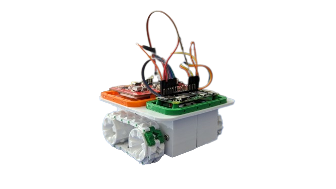
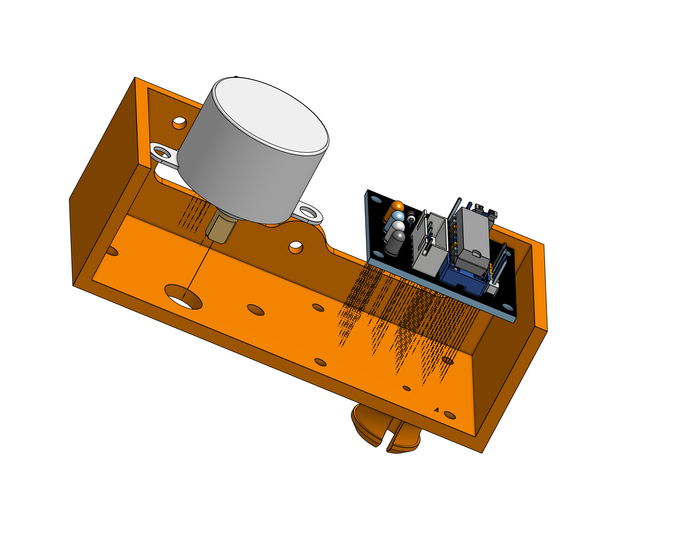
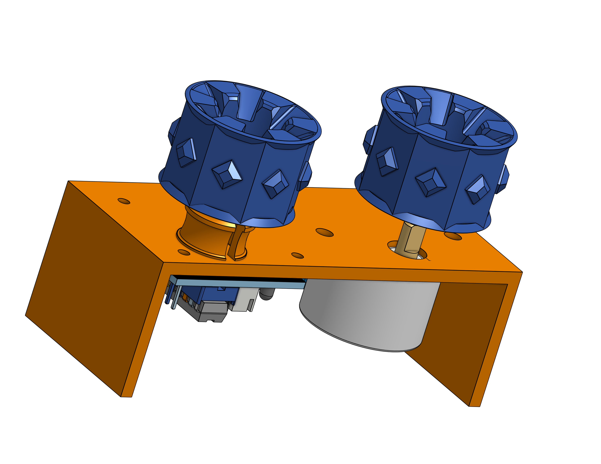
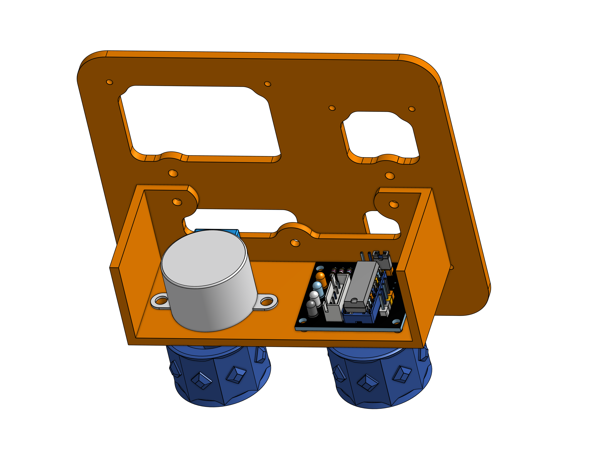
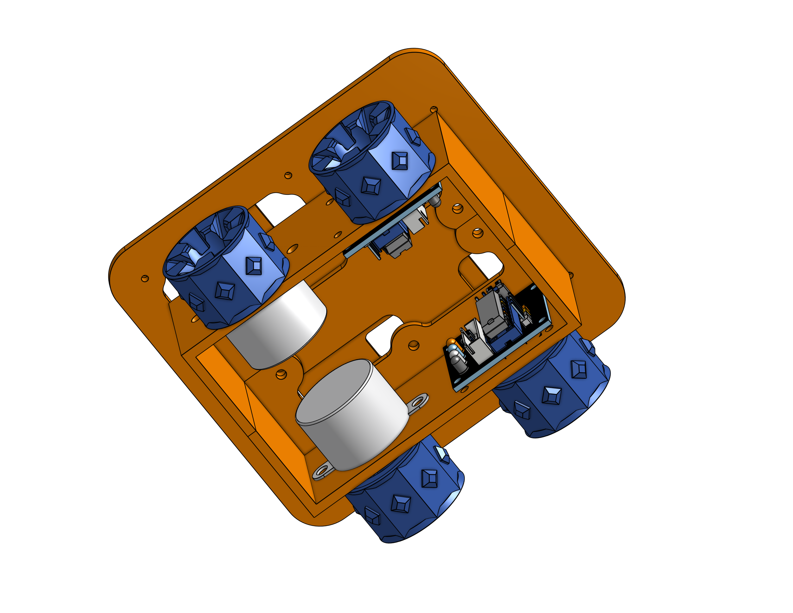
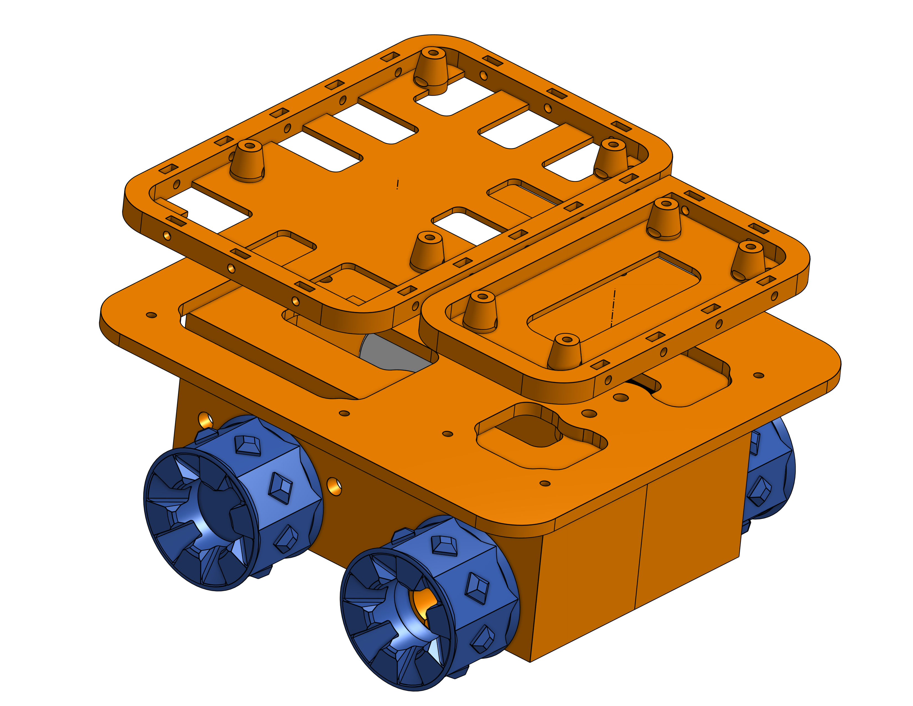

#Tanky - A minimal robot

</img>

#Result

Put a video here

#Assembly
1. Install the motors & motor drivers onto the wheel hub

</img>

</img>

</img>

</img>

</img>

#Electrical

#Programming

#Credits

[Fork OnShape project here](https://cad.onshape.com/documents/0899f84c4eebb7aec9fa8b40/w/612001ece4ad1e9ab4301937/e/16cf93df3dd15af74282f1d0?renderMode=0&uiState=65680199218dde31bb9a6cd2)